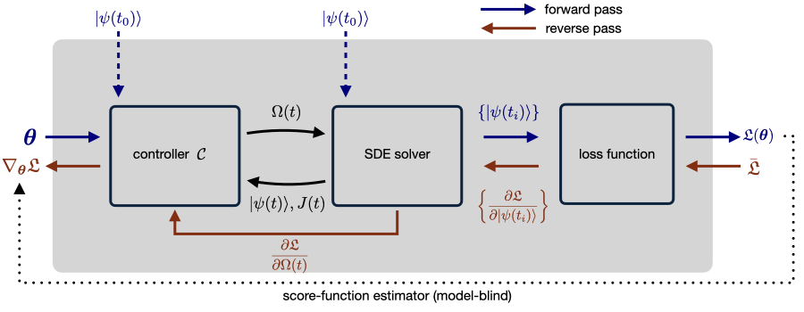

# Control of Stochastic Quantum Dynamics with Differentiable Programming

This repository contains a julia implementation for the method introduced in our
[paper](https://arxiv.org/abs/2101.01190) based on the [SciML ecosytem](https://sciml.ai/).
A slimmed-down version of the examples with faster runtimes is provided in the
[SciML/DiffEqFlux docs](https://diffeqflux.sciml.ai/dev/examples/SDE_control/).

### Abstract of the paper
Controlling stochastic dynamics of a quantum system is an indispensable task in
fields such as quantum information processing and metrology. Yet, there is no general
ready-made approach to design efficient control strategies. Here, we propose a
framework for the automated design of control schemes based on differentiable
programming (∂P). We apply this approach to state preparation and stabilization
of a qubit subjected to homodyne detection. To this end, we formulate the control
task as an optimization problem where the loss function quantifies the distance
from the target state and we employ neural networks (NNs) as controllers. The
system's time evolution is governed by a stochastic differential equation (SDE).
To implement efficient training, we backpropagate the gradient information from
the loss function through the SDE solver using adjoint sensitivity methods. As a
first example, we feed the quantum state to the controller and focus on different
methods to obtain gradients. As a second example, we directly feed the homodyne
detection signal to the controller. The instantaneous value of the homodyne current
contains only very limited information on the actual state of the system, covered
in unavoidable photon-number fluctuations. Despite the resulting poor signal-to-noise
ratio, we can train our controller to prepare and stabilize the qubit to a target
state with a mean fidelity around 85%. We also compare the solutions found by the
NN to a hand-crafted control strategy.


<p align="center">
  
</p>

### Control scenarios

The repository contains different examples for the control of a single qubit:

* SDE control based on full knowledge of the state of the qubit and a continuously
  updated control drive using continuous adjoint sensitivity methods, see [the file](./continuously-updated-control/Control.jl).

* SDE control based on full knowledge of the state of the qubit and a
  piecewise-constant control drive using a direct AD approach, see [the file](./piecewise-constant-control/Control.jl).

* SDE control based on the record of the measured homodyne current and a
  piecewise-constant control drive using a direct AD approach, see [the file](./homodyne-current/Control.jl).

* ODE control (closed quantum system) based on full knowledge of the state of
  the qubit and a continuously updated control drive using continuous adjoint
  sensitivity methods, see [the file](./closed-system/Control.jl).

* SDE control based on full knowledge of the state of the qubit and a continuously
  updated control drive using the hand-crafted strategy, see [the file](./hand_crafted/Control.jl).  


### How to run/ prerequisites:

- install [julia](https://julialang.org/downloads/)
- individual files can be executed by calling, e.g., `julia --threads 10 Control.jl 0.001 1000 1`
  from terminal. Please find the possible parser arguments in the respective julia file.
- output data/figures are stored in the associated data/figures folder.
- other physical systems can be implemented by modifying the respective drift and
  diffusion functions:

  ```julia

  function qubit_drift!(du,u,p,t)
    # expansion coefficients |Ψ> = ce |e> + cd |d>
    ceR, cdR, ceI, cdI = u # real and imaginary parts

    # Δ: atomic frequency
    # Ω: Rabi frequency for field in x direction
    # κ: spontaneous emission
    Δ, Ωmax, κ = p[end-2:end]
    nn_weights = p[1:end-3]
    Ω = (nn(u, nn_weights).*Ωmax)[1]

    @inbounds begin
      du[1] = 1//2*(ceI*Δ-ceR*κ+cdI*Ω)
      du[2] = -cdI*Δ/2 + 1*ceR*(cdI*ceI+cdR*ceR)*κ+ceI*Ω/2
      du[3] = 1//2*(-ceR*Δ-ceI*κ-cdR*Ω)
      du[4] = cdR*Δ/2 + 1*ceI*(cdI*ceI+cdR*ceR)*κ-ceR*Ω/2
    end
    return nothing
  end

  function qubit_diffusion!(du,u,p,t)
    ceR, cdR, ceI, cdI = u # real and imaginary parts

    @inbounds begin
      du[2] += sqrt(κ)*ceR
      du[4] += sqrt(κ)*ceI
    end
    return nothing
  end

  ```
  to the system at-hand.

- alternative basis expansions replacing the neural networks are described in
  the [docs](https://diffeqflux.sciml.ai/dev/layers/BasisLayers/). For instance,
  one may use a tensor layer of a polynomial basis expansion:
  ```julia
  A = [PolynomialBasis(5)]
  nn = TensorLayer(A, 4)
  p_nn = nn.p
  ```


## Authors:

- [Frank Schäfer](https://github.com/frankschae)
- Pavel Sekatski
- [Martin Koppenhöfer](https://github.com/mako-git)
- Christoph Bruder
- [Michal Kloc](https://github.com/MikeKlocCZ)

```
@article{schaefer_DP_2021,
  title={Control of Stochastic Quantum Dynamics with Differentiable Programming},
  author={Frank Sch\"{a}fer, Pavel Sekatski, Martin Koppenh\"{o}fer, Christoph Bruder, Michal Kloc},
  journal={arXiv preprint arXiv:2101.01190},
  year={2021}
}
```
